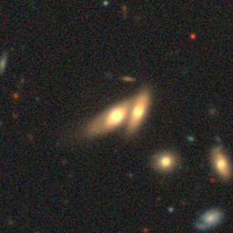

# Morphological Classification of Galaxies

#### First portfolio version

This repository studies galaxy morphology through two complementary data
modalities: a verified tabular baseline and a separate image-classification
pipeline. The project combines reproducible data preparation, classical
machine learning, unsupervised analysis, and a PyTorch CNN experiment.

## Two Different Datasets

The tabular and image analyses do not use the same dataset, objects, or labels.
They are deliberately treated as separate scientific tasks:

| Pipeline | Dataset and objects | Labels or target |
|---|---|---|
| Tabular supervised and unsupervised analysis | Legacy course asset described as derived from SDSS; rows are photometric observations grouped by coordinates | Confident `elliptical` versus `spiral`; `uncertain` and conflicting coordinate groups are excluded from the supervised task |
| Image classification | Galaxy10 DECaLS; 17,736 RGB images from a Galaxy Zoo morphology dataset | Ten morphology classes, including `Merging Galaxies`, `Disturbed Galaxies`, smooth, spiral, and edge-on classes |

The tabular rows cannot be interpreted as the same objects shown in the
Galaxy10 images, and the two label systems are not interchangeable. The
tabular dataset is retained as the primary reproducible baseline; Galaxy10 is a
separate, more demanding image problem.

The tabular asset is described as being derived from the Sloan Digital Sky
Survey (SDSS), but its original release and extraction query are unavailable.
The project therefore documents and verifies the supplied file without making
a claim of fully reproducible upstream provenance.

## Current State

The repository contains a reproducible tabular baseline, a leakage-aware
unsupervised analysis, Galaxy10 preparation and inspection notebooks, and a
PyTorch image-training notebook with visible grid-search and epoch progress.
The tabular model is currently the strongest validated result in the project.

The image pipeline is reported as an experimental result rather than as a
replacement for the tabular task. Its baseline and follow-up metrics are
documented in [verified results](docs/results.md), with no trained weights
committed to the repository.

This is a suitable first presentable version of the portfolio: the main result
is reproducible and clearly separated from the more computationally demanding
image experiment.

## Environment setup

The project is tested with Python 3.10. The original `requirements.txt` was a
platform-specific Conda export and could not be installed with `pip`; it has
been replaced by portable direct dependencies.

Using Conda or Miniforge:

```bash
conda env create -f environment.yml
conda activate galaxy-classification
python scripts/validate_environment.py
```

For an existing Python 3.10 environment:

```bash
python -m pip install -r requirements.txt
python scripts/validate_environment.py
```

The notebooks depend on the prepared datasets and the configured environment;
the image training notebook requires a working CUDA-enabled PyTorch install.

## Data integrity workflow

`galaxias_1.csv` is retained as an immutable legacy course asset. Its stored
`objID` values have lost precision and must not be used as unique identifiers.
The replacement workflow preserves every source row, adds deterministic lineage
and coordinate-group identifiers, and keeps `uncertain` distinct from any
irregular morphology class.

```bash
python scripts/audit_data.py
python scripts/build_dataset.py
pytest
```

The generated prepared dataset is intentionally not committed. See the
[data card](docs/data-card.md) for provenance, identity, label, and
transformation policies.

## Reproducible tabular baseline

The primary supervised task compares confident elliptical and spiral labels.
Uncertain rows and coordinate groups with conflicting labels are excluded from
model fitting, while repeated coordinate groups are kept entirely within one
partition to prevent train/test leakage.

```bash
python scripts/train_tabular.py
```

Model selection uses group-aware cross-validation on the development set. The
held-out test partition is used once after selection. Preprocessing, including
quantile clipping and median imputation, is fitted inside each training fold.
See the [verified results](docs/results.md) for the complete evaluation and
limitations.

## Reproducible unsupervised analysis

The clustering workflow aggregates repeated observations by exact coordinate,
selects the number of clusters using label-independent silhouette and stability
criteria, and fits PCA and t-SNE using scientific features only. Cluster labels
and source labels are attached after each embedding is complete.

```bash
python scripts/run_unsupervised.py
```

## Image-classification prototype

The selected image dataset is Galaxy10 DECaLS: 17,736 `256x256x3` galaxy images
in ten Galaxy Zoo morphology classes. Individual images contain faint extended
objects, bright central cores, low-contrast structure, background sources, and
subtle differences between neighboring morphology classes. A merging galaxy can
be visually ambiguous even for a human observer, which makes this a harder
problem than the compact tabular baseline.



The computational cost is correspondingly high: the dataset contains billions
of pixel values, training repeatedly reads large `256x256` batches, and the
pipeline evaluates 24 CNN configurations before the final long training run.
The current training path uses GPU mini-batch optimization, GPU-side
right-angle rotation and flip augmentation, deterministic splits, and
validation-only model selection.

```bash
python -m pip install --force-reinstall -r requirements-gpu.txt
python scripts/check_torch_gpu.py
python scripts/prepare_galaxy10.py
jupyter lab notebooks/04-galaxy10-inspection.ipynb
jupyter lab notebooks/05-galaxy10-pytorch-training.ipynb
```

Trained weights are not committed, but the historical baseline and latest image
metrics are recorded in [verified results](docs/results.md). See the full
[image-pipeline protocol](docs/image-pipeline.md).

## License

The repository's original code is available under the [MIT License](LICENSE).
SDSS data and imagery remain subject to their own attribution and usage terms.
