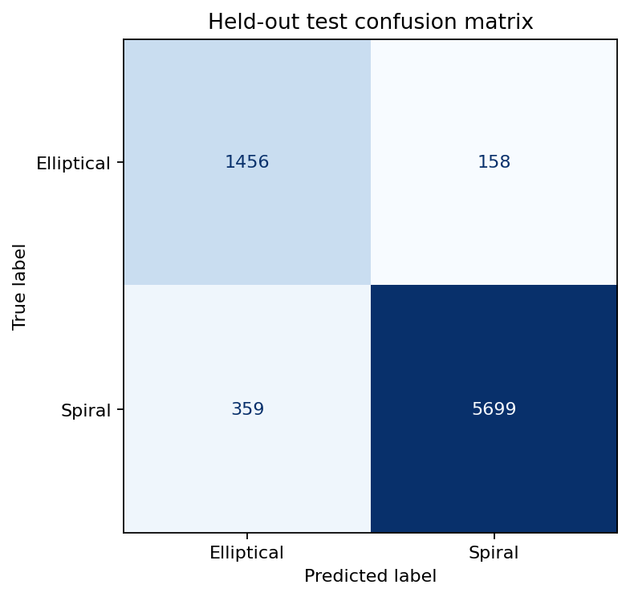

# Verified Results

## Status

The tabular elliptical-versus-spiral baseline is the first result regenerated
under the repaired workflow. Historical notebook metrics are not used as
portfolio evidence because they relied on damaged identity, globally fitted
preprocessing, or resampling before the holdout split.

## Evaluation design

- Source: checksum-verified legacy course asset.
- Target: confident `elliptical` versus `spiral` source labels.
- Excluded: 53,799 uncertain rows and 22 confident rows belonging to coordinate
  groups with conflicting labels.
- Eligible sample: 38,281 rows in 34,813 coordinate groups.
- Holdout: 7,672 rows in 6,963 coordinate groups (20%).
- Development set: 30,609 rows in 27,850 coordinate groups (80%).
- Model selection: four-fold stratified group cross-validation on development
  data, optimizing macro F1.
- Leakage control: no coordinate group appears in both partitions. The nearest
  test-to-development coordinate separation is 5.52 arcseconds; none are within
  5 arcseconds and three are within 10 arcseconds.
- Preprocessing: invalid magnitude artifacts (`abs(value) > 100`) become
  missing, followed by 1st/99th percentile clipping, median imputation, and
  scaling where applicable. Learned steps are fitted inside the relevant
  training fold.

The evaluated features are r-band magnitude, four adjacent-band color
differences, Petrosian radius, and redshift. Identifiers, row numbers, targets,
the damaged `objID`, and assigned labels are not model inputs.

## Model selection

| Model | Development CV macro F1 | Notes |
|---|---:|---|
| Prior dummy | 0.439 ± 0.002 | Predicts the majority class |
| Balanced logistic regression | 0.770 ± 0.014 | Linear baseline |
| Balanced random forest | **0.890 ± 0.005** | Selected by development CV |

The selected forest uses 200 trees, unlimited depth, and a minimum of five
samples per leaf. The small search did not inspect the held-out test set.

## Held-out test results

| Model | Accuracy | Balanced accuracy | Macro F1 |
|---|---:|---:|---:|
| Prior dummy | 0.790 | 0.500 | 0.441 |
| Balanced logistic regression | 0.826 | 0.856 | 0.783 |
| Balanced random forest | **0.933** | **0.921** | **0.903** |

The group-bootstrap 95% interval for the selected model's macro F1 is
0.895–0.911.

Selected-model class metrics:

| Class | Precision | Recall | F1 | Support |
|---|---:|---:|---:|---:|
| Elliptical | 0.802 | 0.902 | 0.849 | 1,614 |
| Spiral | 0.973 | 0.941 | 0.957 | 6,058 |



The complete machine-readable result is available in
`reports/results/tabular_metrics.json` and can be regenerated with:

```bash
python scripts/train_tabular.py
```

## Limitations

- The upstream SDSS query and label-generation process remain unavailable.
- Coordinate grouping prevents exact-position leakage but cannot prove that all
  repeated physical objects have been identified.
- Metrics are row-level, so coordinate groups with multiple observations have
  greater weight.
- The result covers only confident elliptical/spiral labels and says nothing
  about irregular galaxies.
- The test set comes from the same legacy course asset; there is no external
  survey or independently labeled validation set.
- Feature clipping is a pragmatic training-only robustness step, not a
  scientifically validated replacement for missing-value flags.
